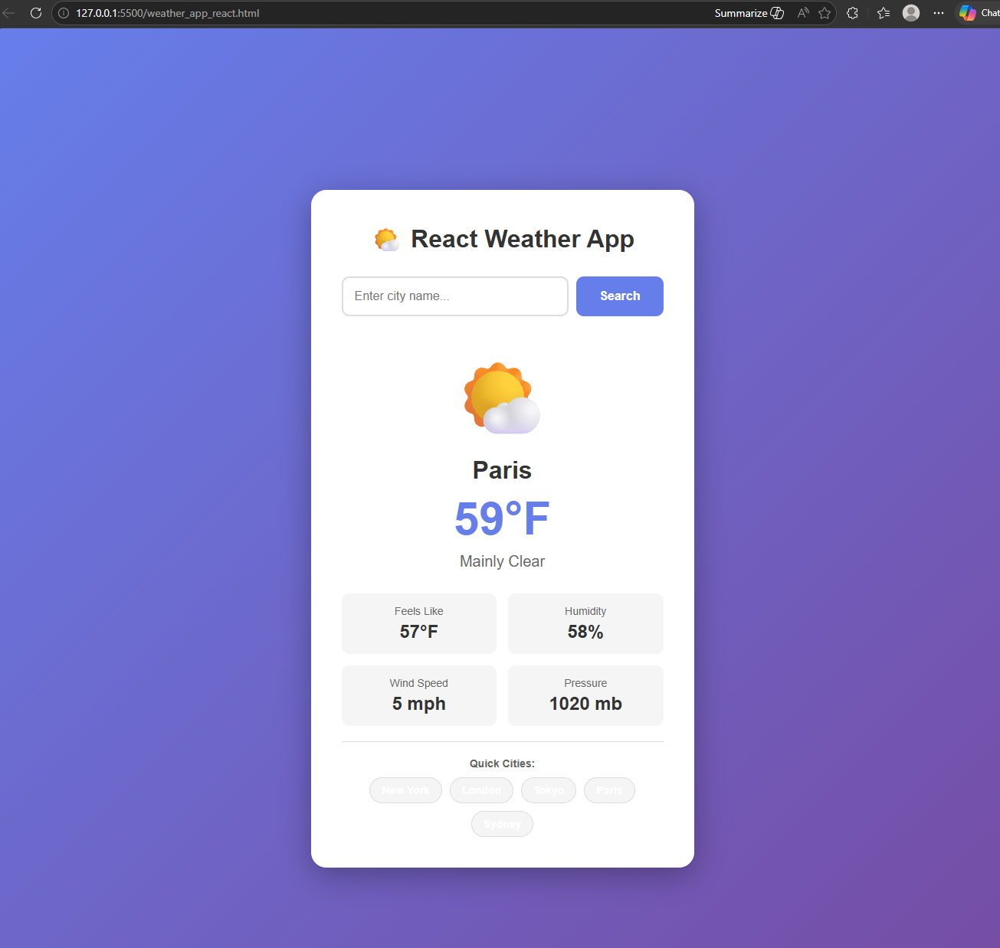

# React Weather App

A responsive weather app built with React, powered by 
the Open-Meteo API. No API key required.

**[Live Demo](https://weather-app-by-iryna.netlify.app/)**

---



---

## Features

- Search current weather by city name
- Displays temperature, feels like, humidity, wind speed and pressure
- Weather condition icons (clear, cloudy, rain, snow, thunderstorm)
- Quick-select buttons for popular cities
- Remembers your last searched city with localStorage
- Loading and error states handled throughout

---

## Built with

- React 18
- Open-Meteo API (free, no API key needed)
- localStorage for last city persistence
- Pure CSS (no frameworks)

---

## Getting started

Just open `weather_app_react.html` in your browser — no install needed.

Or serve it locally:

```bash
npx serve .
```

---

## What I learned

This project taught me how to fetch and display live data 
from a weather API, map weather codes to human-readable 
descriptions and icons, and use localStorage to persist 
user preferences between sessions.

---

## Author

Iryna Greshchuk · [GitHub](https://github.com/greshchuk-dev) ·
[LinkedIn](https://linkedin.com/in/YOUR-LINKEDIN)
